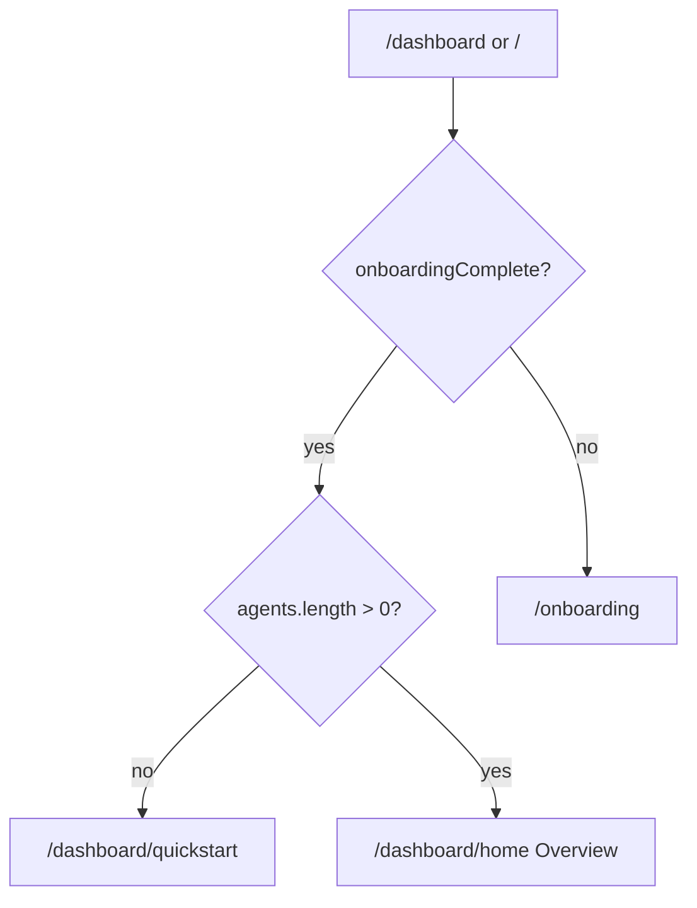
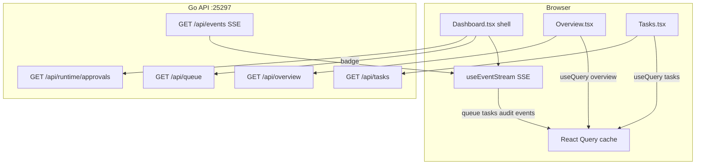
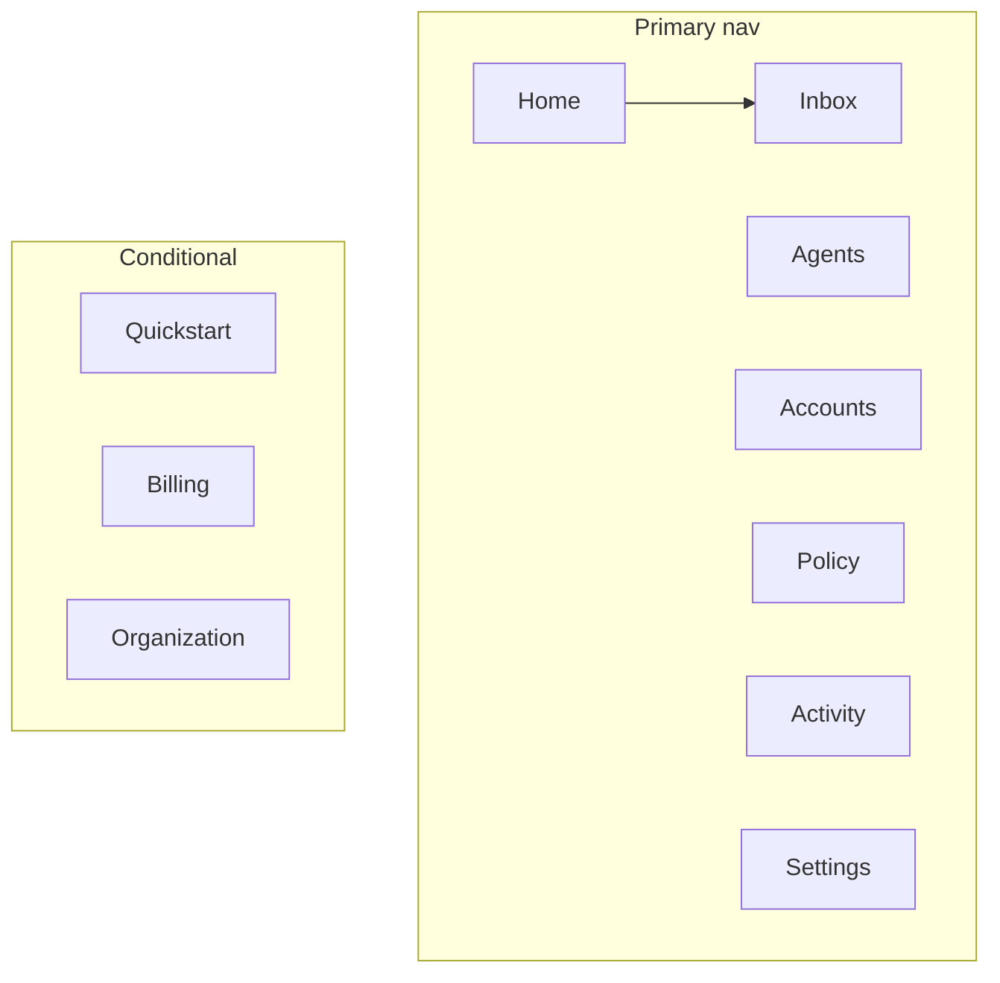
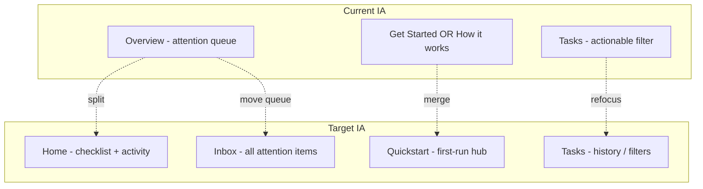
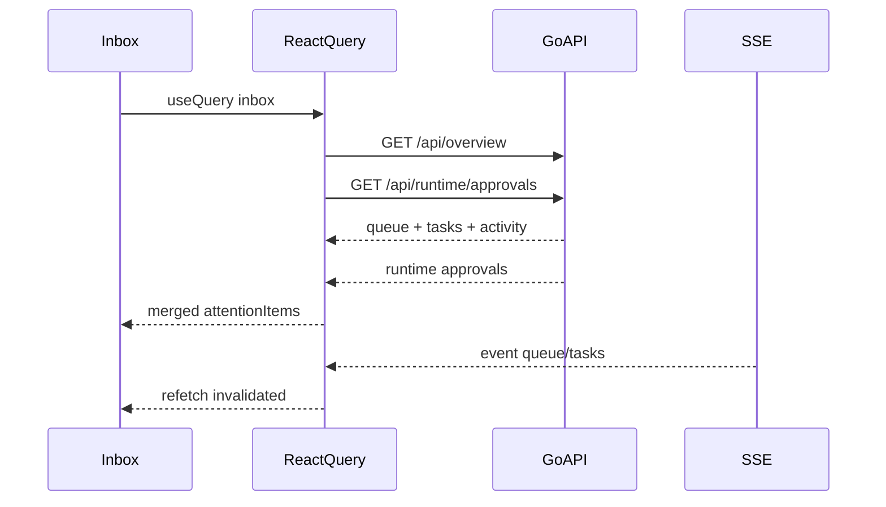

# Clawvisor Dashboard — Product Requirements Document

**Version:** 1.1  
**Status:** Draft  
**Last updated:** 2026-06-06  
**Scope:** Dashboard frontend (`web/`) with optional API extensions noted per phase

### Product decisions (locked)

| Decision | Resolution |
|----------|------------|
| Default landing when no agents | **Redirect to Quickstart** (`/dashboard/quickstart`) — users with zero configured agents must not land on Home/Overview |

---

## 1. Executive summary

### Vision

Transform the Clawvisor dashboard into a **single command center** for agent oversight: one place to see what needs attention, approve or deny actions, monitor activity, and complete setup — regardless of deployment mode (self-hosted magic link, proxy-lite, or team/billing).

### Problem in one sentence

Users must navigate fragmented pages, duplicated approval UIs, and feature-flag-dependent navigation to accomplish jobs that should be answerable from one screen: *"What needs my attention right now?"*

### Scope

| In scope | Out of scope (v1 PRD) |
|----------|----------------------|
| Information architecture (IA) redesign | Backend policy engine changes |
| Unified attention inbox | Replacing magic-link auth flow |
| Onboarding / activation funnel | Full Figma design system handoff |
| Visual layout consistency | New adapter or service types |
| Mobile attention affordances | |
| Component decomposition (engineering) | |
| Optional API bundling (Phase 2+) | |

### Primary personas

All three personas are first-class; requirements are segmented by persona in §5 and tagged in user stories.

---

## 2. Background and current architecture

### 2.1 Stack and entry

- **Frontend:** React 18 + Vite + TypeScript + Tailwind, SPA in `web/`
- **Routing:** react-router-dom v6 — top-level routes in `web/src/App.tsx`, dashboard nested routes in `web/src/pages/Dashboard.tsx`
- **State / data:** TanStack React Query (`web/src/main.tsx`), typed API client (`web/src/api/client.ts`), auth context (`web/src/hooks/useAuth.tsx`)
- **Real-time:** SSE via `web/src/hooks/useEventStream.ts` (invalidates query caches on server events)
- **Production serve:** Built `web/dist/` embedded in Go binary (`web/embed.go`) or served from `frontend_dir` config; SPA fallback in `internal/api/server.go`

### 2.2 Bootstrap flow

```
main.tsx
  └─ BrowserRouter
       └─ QueryClientProvider (staleTime: 30s)
            └─ AuthProvider
                 └─ App (Routes + ErrorBoundary)
```

Authenticated users hit `/dashboard` after login. `RequireAuth` gates all dashboard routes and redirects incomplete security onboarding to `/onboarding` (`SecuritySetup.tsx`).

**Target landing logic** (nested index route in `Dashboard.tsx`):



- **No agents** → Quickstart (setup hub); this is the first-run experience after magic-link or password login.
- **≥1 agent** → Home (Overview): activity, checklist for remaining setup steps, summary widgets.
- Deep links (`?action=`, `?request_id=`, `?task_id=`) bypass the agent gate and route to **Inbox** so approvals are never blocked by Quickstart redirect.
- Explicit nav to any other route (Agents, Settings, etc.) is never overridden.

### 2.3 Dashboard shell responsibilities

`Dashboard.tsx` is the **layout shell**, not a page:

- Left sidebar navigation (desktop sticky / mobile drawer)
- Global alert banners: version update, LLM spend cap, billing status
- `OnboardingBanner` component
- `useEventStream()` for live invalidation
- Sidebar queue badge: `api.queue.list()` + runtime approvals when `features.runtime_activity`
- Nested `<Routes>` rendering page content in `<main>`

### 2.4 Data flow (current)



### 2.5 Key API endpoints (dashboard data)

| Endpoint | Handler | Used by | Returns |
|----------|---------|---------|---------|
| `GET /api/overview` | `internal/api/handlers/overview.go` | `Overview.tsx` | `queue`, `active_tasks`, `activity` (60-min buckets) |
| `GET /api/queue` | queue handler | `Dashboard.tsx` badge | All queue items + total |
| `GET /api/tasks` | tasks handler | `Tasks.tsx`, `TaskCard` | Paginated tasks |
| `GET /api/runtime/approvals` | runtime handler | `Overview.tsx`, shell badge | Runtime approval records |
| `GET /api/runtime/status` | runtime handler | `Overview.tsx`, shell | Proxy enabled, policy defaults |
| `GET /api/services` | services handler | `Services.tsx`, `OnboardingBanner` | Service catalog + activation state |
| `GET /api/agents` | agents handler | Multiple pages | Agent list |
| `GET /api/welcome/suggestions` | welcome handler | `GetStarted.tsx` | Setup readiness + suggestions |
| `POST /api/events/ticket` + SSE | events handler | `useEventStream.ts` | Live invalidation |

### 2.6 Current navigation (sidebar)

| Nav label | Route | Page file | Feature gate |
|-----------|-------|-----------|--------------|
| How it works | `/dashboard/how-it-works` | `HowItWorks.tsx` | Shown when `features.proxy_lite` |
| Overview | `/dashboard` | `Overview.tsx` | Always |
| Get Started | `/dashboard/get-started` | `GetStarted.tsx` | Hidden when `proxy_lite` |
| Tasks | `/dashboard/tasks` | `Tasks.tsx` | Always |
| Accounts | `/dashboard/accounts` | `Services.tsx` | Always |
| Policy | `/dashboard/policy` | `Restrictions.tsx` | Always |
| Agents | `/dashboard/agents` | `Agents.tsx` | Always |
| Activity | `/dashboard/activity` | `Audit.tsx` | Always |
| Settings | `/dashboard/settings` | `Settings.tsx` | Always |
| Billing | `/dashboard/billing` | `Billing.tsx` | `features.billing` |
| Organization * | `/dashboard/org/*` | `OrgSettings.tsx`, etc. | `features.teams` |

\* Org sub-nav: Members, Custom Adapters, MCP Servers.

Legacy redirects preserved: `/dashboard/services` → accounts, `/dashboard/audit` → activity, `/dashboard/restrictions` → policy, `/dashboard/runtime` → policy.

---

## 3. Problem statement

### 3.1 Information architecture

| Issue | Impact | Evidence |
|-------|--------|----------|
| Nav swaps by deployment mode | Users on different builds see different sidebars for the same mental task ("get started") | `Dashboard.tsx` filters `how-it-works` vs `get-started` by `features.proxy_lite` |
| Onboarding scattered across 4+ surfaces | New users don't know whether to use banner, Get Started, Welcome, or Security Setup | `OnboardingBanner.tsx`, `GetStarted.tsx`, `Welcome.tsx`, `SecuritySetup.tsx` |
| "Overview" vs "Tasks" overlap | Pending tasks appear on Home and Tasks; approvals have separate card types on Home only | `Overview.tsx` attention section vs `Tasks.tsx` filter `actionable` |
| No dedicated Inbox concept | Sidebar badge counts queue but there is no nav item named for triage | Badge on Overview nav item only |

### 3.2 Workflow friction

| Issue | Impact | Evidence |
|-------|--------|----------|
| Duplicated approval UX | Four card implementations on Overview (`ApprovalCard`, `RuntimeApprovalCard`, `ConnectionQueueCard`, `TaskCard`) plus full `TaskCard` on Tasks | `Overview.tsx` ~415–847 |
| Deep-link handling duplicated | Same `?action=approve&request_id=` logic in Overview and Tasks | `Overview.tsx` L61–72, `Tasks.tsx` L63–78 |
| Inline-chat-bound errors opaque | Approve/deny from dashboard fails with `INLINE_CHAT_BOUND`; user told to "reply in chat" with no context | `Overview.tsx`, `Tasks.tsx`, `TaskCard.tsx` L364+ |
| Runtime approvals require extra fetches | Overview merges queue + runtime approvals client-side; badge uses separate queries | `Overview.tsx` L92–144, `Dashboard.tsx` L62–91 |

### 3.3 Visual and layout consistency

| Issue | Impact | Evidence |
|-------|--------|----------|
| Inconsistent page templates | Get Started uses `max-w-6xl` + sticky TOC; Overview/Services use flat padding | `GetStarted.tsx` L30 vs `Overview.tsx` L186 |
| Banner stacking | Up to 4 global banners above content (version, onboarding, LLM cap, billing) | `Dashboard.tsx` L278–349 |
| Monolithic pages | Hard to add panels without large diffs | `Services.tsx` ~2,200 lines, `TaskCard.tsx` ~1,200 lines |

### 3.4 Mobile and responsive

| Issue | Impact | Evidence |
|-------|--------|----------|
| Attention only in hamburger flow | Mobile header shows queue count but tapping goes to Overview, not a focused inbox | `Dashboard.tsx` L125–144 |
| No bottom affordance | Approvals on phone require opening sidebar → Overview | Mobile nav pattern |
| Touch targets vary | Approve/deny buttons differ in size across card types | Overview inline cards vs `TaskCard` |

### 3.5 Extensibility

| Issue | Impact | Evidence |
|-------|--------|----------|
| New dashboard panels require touching shell + page | No shared `PageLayout` or panel slot convention | Ad-hoc sections in each page |
| Feature flags control nav visibility | Adding a feature means editing nav array + routes + sometimes duplicate content | `Dashboard.tsx` navItems filter |

---

## 4. Goals and non-goals

### 4.1 Goals

1. **Reduce time-to-first-action** — New users with no agents land on **Quickstart** immediately; connect an agent and approve a first task without hunting across pages.
2. **Unify the attention queue** — One mental model and one component family for approvals, tasks, connections, and runtime items.
3. **Consistent layout vocabulary** — Shared page header, spacing, empty states, and semantic color tokens.
4. **Persona-appropriate defaults** — Same nav structure across deployments; content blocks adapt via `features.*`, not nav item swaps.
5. **Maintainable codebase** — Decompose mega-files so dashboard improvements ship incrementally.

### 4.2 Non-goals (this PRD cycle)

- Changing runtime policy evaluation or approval backend semantics
- Redesigning auth flows (magic link, MFA, passkeys)
- Building a separate design-system package or Figma library
- Replacing Recharts or the activity histogram algorithm
- Org-level RBAC changes beyond clearer UI context

---

## 5. User personas and jobs-to-be-done

### 5.1 Persona summary

| Persona | Primary job | Dashboard priority |
|---------|-------------|-------------------|
| **Solo self-hosted** | Connect agent + account, approve first task | Onboarding checklist, clear empty states, magic-link landing |
| **Power operator** | Triage high-volume approvals, monitor runtime | Unified inbox, density, keyboard shortcuts |
| **Team admin** | Manage org agents, billing, shared credentials | Org context banner, usage visibility, member flows |

### 5.2 Solo self-hosted — Alex

**Context:** Runs Clawvisor locally, signs in via magic link from terminal, uses proxy-lite or standard mode.

**Jobs to be done:**

- J1: Understand what Clawvisor does and what to do first
- J2: Connect an AI agent without reading docs
- J3: Connect Gmail/GitHub and approve the first agent task

**Scenarios:**

1. **Magic-link landing** — Alex opens `/magic-link?token=…`, which redirects to `/dashboard`. *Today:* lands on Overview empty state + dismissible onboarding banner. *Target:* with zero agents, immediately redirected to **Quickstart** (`/dashboard/quickstart`) with connect-agent as the primary CTA; no empty Overview.

2. **First connection request** — Agent knocks; connection appears in queue. *Today:* `ConnectionQueueCard` only on Overview. *Target:* same card in unified Inbox with prominent Approve.

3. **First agent connected** — Alex pairs an agent, returns to `/dashboard`. *Target:* redirect gate clears; Alex lands on **Home** with checklist for remaining steps (account, first approval). Empty inbox shows "All clear" plus checklist progress, not a dead end.

### 5.3 Power operator — Jordan

**Context:** Multiple agents, runtime proxy enabled, Telegram notifications with deep links, heavy approval volume.

**Jobs to be done:**

- J1: Triage all pending items in one pass
- J2: Approve/deny from notification deep links without confusion
- J3: Monitor runtime policy health and active sessions

**Scenarios:**

1. **Telegram deep link** — Opens `/dashboard?action=approve&request_id=…&task_id=…`. *Today:* Overview handles on mount, shows result banner. *Target:* Inbox opens, item highlighted, inline-chat-bound shows disabled actions + explanation.

2. **Mixed queue** — Standalone approval + task pending approval + runtime retry approval. *Today:* three different card UIs on Overview, sorted by `created_at`. *Target:* one `AttentionCard` family with type badge, shared action bar.

3. **High volume** — 15+ pending items. *Today:* no pagination on Overview queue; Tasks page separate. *Target:* Inbox with scroll/pagination, optional compact density.

### 5.4 Team admin — Sam

**Context:** Org owner on billing plan, switches org context, manages members and org-wide adapters.

**Jobs to be done:**

- J1: Know which org context is active before approving
- J2: See org-level agent/task activity
- J3: Manage billing without leaving dashboard unexpectedly

**Scenarios:**

1. **Org switch** — Sam selects org in `OrgSelector`. *Today:* Services page switches to `OrgServicesView`; Overview still shows personal queue. *Target:* persistent org context chip in shell header; Inbox scope labeled (personal vs org).

2. **Billing expiry banner** — Subscription past due. *Today:* red banner with link to pricing/billing. *Target:* single alert slot in notification center; billing CTA preserved.

3. **Member onboarding** — Invites teammate. *Today:* org routes under sidebar org section. *Target:* unchanged routes, clearer org section label and Setup checklist hidden when in org context.

---

## 6. Proposed solution — epics

### Epic A: Information architecture redesign

**Intent:** Stable nav structure across deployments; consolidate educational content.

#### Proposed nav (target state)



| Current | Proposed | Notes |
|---------|----------|-------|
| Overview | **Home** | `/dashboard/home` or index when agents exist — activity chart, checklist, summary metrics |
| (none) | **Inbox** | `/dashboard/inbox` — unified attention queue |
| Get Started + How it works | **Quickstart** | `/dashboard/quickstart` — default landing when `agents.length === 0`; feature-aware setup content |
| Tasks | **Tasks** | Historical/archive view; actionable items primary in Inbox |
| Accounts | **Accounts** | Unchanged route `/dashboard/accounts` |
| Policy | **Policy** | Unchanged |
| Activity | **Activity** | Unchanged |
| Settings | **Settings** | Unchanged |

**Legacy redirects (keep):** `/dashboard/get-started`, `/dashboard/how-it-works`, and `/dashboard/setup` → `/dashboard/quickstart` (hash anchors preserved). All legacy paths kept for one release cycle minimum.

**Quickstart nav placement:** Always visible in sidebar (not conditional on `proxy_lite`). Label: **Quickstart**.

**Affected files:** `web/src/pages/Dashboard.tsx` (navItems, Routes, index redirect), new `web/src/pages/Inbox.tsx`, new `web/src/pages/Quickstart.tsx` (refactor from `GetStarted.tsx` + `HowItWorks.tsx`).

---

### Epic B: Unified attention inbox

**Intent:** One sorted list, one card component family, one deep-link handler.

#### Data sources (Phase 1 — no API change)

| Source | Query | Merged into inbox |
|--------|-------|-------------------|
| Queue items | `api.overview.get().queue` | approval, task, connection types |
| Runtime approvals | `api.runtime.listApprovals()` + session filter | runtime_approval type |
| Sort key | `created_at` descending | Same as current Overview |

#### Phase 2 API optional enhancement

Extend `GET /api/overview` response to include `runtime_approvals` and `queue_total` so Inbox + sidebar badge share one request. Handler: `internal/api/handlers/overview.go`.

#### New components (proposed)

```
web/src/components/attention/
  AttentionInbox.tsx      # list container, empty state, sorting
  AttentionCard.tsx       # dispatcher by item.kind
  ApprovalAttentionCard.tsx
  TaskAttentionCard.tsx   # thin wrapper → TaskCard or extracted header/actions
  ConnectionAttentionCard.tsx
  RuntimeAttentionCard.tsx
  InlineChatBoundNotice.tsx
  useAttentionDeepLinks.ts  # shared ?action= handler
```

**Affected files:** Extract from `Overview.tsx` L415–847; consume in new `Inbox.tsx`; slim `Overview.tsx` to summary-only.

---

### Epic C: Onboarding and activation funnel

**Intent:** Quickstart is the first-run destination; replace dismiss-only banner with a persistent checklist on Quickstart (and Home once agents exist).

#### Checklist steps (feature-aware)

| Step | Condition | CTA |
|------|-----------|-----|
| Security onboarding | `onboardingComplete === false` | `/onboarding` (existing) |
| Connect agent | `agents.length === 0` | `/dashboard/agents` |
| Connect account | no activated service | `/dashboard/accounts` |
| First approval | no completed/denied task in audit | `/dashboard/inbox` |
| Optional: LLM key | `llmStatus.spend_cap_exhausted` | `/dashboard/settings` |

**proxy_lite order:** Agent before account (matches `OnboardingBanner` proxy-lite branch).  
**Legacy order:** Account and agent either order; checklist shows both incomplete steps.

**Component:** `web/src/components/SetupChecklist.tsx` on **Quickstart** (always when any step incomplete) and on **Home** (compact summary when agents exist but setup incomplete). `OnboardingBanner` deprecated — redirect gate + checklist replace it.

**Affected files:** `web/src/components/OnboardingBanner.tsx`, `web/src/pages/Quickstart.tsx`, `web/src/pages/Overview.tsx` (or `Home.tsx`), `Dashboard.tsx` (agent gate redirect).

---

### Epic D: Visual and layout system

**Intent:** Predictable page structure and controlled alert surfacing.

#### Standard page template

```tsx
// web/src/components/layout/PageLayout.tsx (new)
// - title, description?, actions? (right-aligned)
// - optional tabs/sub-nav
// - children in consistent padding: p-4 sm:p-8 max-w-7xl mx-auto
```

| Page type | Template |
|-----------|----------|
| Workflow (Accounts, Agents, Tasks) | `PageLayout` |
| Long-form docs (Setup, How it works) | `PageLayout` + optional right TOC (lg+) |
| Home | `PageLayout` + widget grid |
| Inbox | `PageLayout` + full-width list |

#### Banner policy

- **Max one** system-critical banner inline (billing expired OR LLM cap OR version update — priority order documented in code comment).
- Remaining alerts → collapsible **notification strip** or icon dropdown in shell header.
- Onboarding checklist replaces onboarding banner for setup nudges.

#### Design tokens (mandatory)

Use existing CSS variables via Tailwind — do not introduce hardcoded hex in new components:

- Surfaces: `bg-surface-0` … `bg-surface-3`
- Text: `text-text-primary`, `text-text-secondary`, `text-text-tertiary`
- Brand / semantic: `bg-brand`, `text-success`, `text-warning`, `text-danger`
- Borders: `border-border-default`, `border-border-subtle`

Source: `web/src/index.css`, `web/tailwind.config.ts`.

---

### Epic E: Mobile and responsive

**Intent:** Attention queue reachable in one tap on small screens.

| Requirement | Detail |
|-------------|--------|
| Bottom attention bar | Fixed bar when `inboxCount > 0`: "N need attention" → navigates to `/dashboard/inbox` |
| Touch targets | Approve/deny buttons min 44×44px tap area |
| Sidebar | Keep drawer; add Inbox as first nav item on mobile |
| Deep links | Mobile deep links open Inbox, scroll to item if possible |

**Affected files:** `Dashboard.tsx` (mobile header + bottom bar), `AttentionCard` action buttons.

---

### Epic F: Component decomposition (engineering enabler)

**Intent:** Reduce file size before adding features.

| File | Split into |
|------|------------|
| `Services.tsx` (~2,200 lines) | `pages/Accounts.tsx` (shell), `components/accounts/VaultSection.tsx`, `ConnectServiceModal.tsx`, `ActiveServiceRow.tsx`, `LocalServicesSection.tsx` |
| `TaskCard.tsx` (~1,200 lines) | `TaskCardHeader.tsx`, `TaskScopeList.tsx`, `TaskVerificationPanel.tsx`, `TaskActions.tsx`, `TaskAuditTrail.tsx` |
| `Overview.tsx` | `Home.tsx` (widgets), move inbox to `Inbox.tsx` |

Decomposition is **Phase 3**; PRD features should not be blocked on it except where noted.

---

## 7. Feature requirements (user stories and acceptance criteria)

### Epic A — Information architecture

**A-1**  
*As a* solo user *I want* the same sidebar labels regardless of proxy-lite *so that* docs and screenshots match my install.

- AC: Nav shows Home, Inbox, Quickstart, Tasks, Accounts, Policy, Agents, Activity, Settings on all deployments
- AC: Quickstart is reachable at `/dashboard/quickstart` for all; content sections hide/show by `features.*`, not nav item removal
- AC: `how-it-works`, `get-started`, and `/dashboard/setup` redirect to `/dashboard/quickstart` with hash anchors

**A-3**  
*As a* new user with no agents *I want* to land on Quickstart automatically *so that* I know what to do first without seeing an empty dashboard.

- AC: Visiting `/dashboard` or `/` (when authed) with `agents.length === 0` redirects to `/dashboard/quickstart` via `<Navigate replace />`
- AC: Agent count from `api.agents.list()` in personal context, or `api.orgs.agents(orgId)` when `currentOrg` is set
- AC: Redirect does not fire when user navigates directly to another dashboard route (e.g. `/dashboard/settings`)
- AC: Redirect does not fire when URL contains deep-link query params (`action`, `request_id`, `task_id`) — route to Inbox instead
- AC: After first agent is created, `/dashboard` lands on Home

**A-2**  
*As a* team admin *I want* org nav grouped separately *so that* I don't confuse personal and org settings.

- AC: Org section remains below primary nav with visual separator (existing pattern retained)
- AC: When `currentOrg` is set, shell shows org name chip near page title

**Files:** `Dashboard.tsx`, `App.tsx` (if top-level changes), new `Quickstart.tsx`, `MagicLink.tsx` (post-auth target remains `/dashboard`; gate handles redirect)

---

### Epic B — Unified inbox

**B-1**  
*As a* power operator *I want* all pending items in one sorted list *so that* I don't hunt across Overview and Tasks.

- AC: `/dashboard/inbox` lists all attention items sorted by `created_at` desc
- AC: Item types: approval, task (pending_approval / pending_scope_expansion), connection, runtime_approval
- AC: Empty state: "All clear" with link to Activity
- AC: Sidebar badge count === inbox list length (including runtime when enabled)

**B-2**  
*As a* power operator *I want* approve/deny to work consistently *so that* I trust the inbox.

- AC: Each card type uses same action bar placement (deny left, primary right)
- AC: Successful action removes item from list within 2s (SSE or mutation invalidation)
- AC: Failed action shows inline error on card, does not clear item

**B-3**  
*As a* Jordan using Telegram *I want* deep links to open the inbox *so that* I see context around the approval.

- AC: `?action=approve|deny&request_id=&task_id=` handled by `useAttentionDeepLinks` mounted in Inbox (and Home during transition)
- AC: Deep-link result banner shown above inbox list
- AC: Task deep links (`task_id` only) supported for approve/deny/expand_approve/expand_deny

**B-4**  
*As a* user with inline-chat-bound tasks *I want* clear UI when dashboard actions are blocked *so that* I know to reply in the agent chat.

- AC: When API returns `INLINE_CHAT_BOUND`, card shows `InlineChatBoundNotice` with explanation
- AC: Approve/deny buttons disabled (not hidden) with tooltip
- AC: Same pattern on Inbox and Tasks page

**Files:** new `attention/*`, `Inbox.tsx`, `Overview.tsx`, `Tasks.tsx`, `api/client.ts` (no change Phase 1)

---

### Epic C — Onboarding checklist

**C-1**  
*As a* solo user *I want* a visible setup checklist on Quickstart *so that* I know my next step when I have no agents.

- AC: Full checklist renders on Quickstart when any step incomplete (primary surface for new users)
- AC: Compact checklist summary on Home when agents exist but other steps remain
- AC: Completed steps show checkmark; incomplete show CTA link
- AC: Checklist hidden when all steps complete (or collapsible "Setup complete")

**C-2**  
*As a* proxy-lite user *I want* agent-before-account ordering *so that* the flow matches the product model.

- AC: When `features.proxy_lite`, step order: agent → account → first approval
- AC: When not proxy_lite, agent and account steps shown in parallel (either order OK)

**C-3**  
*As a* user *I want* the dismissible banner gone for setup *so that* I don't lose guidance accidentally.

- AC: `OnboardingBanner` removed or only used for non-checklist alerts (billing, etc.)
- AC: Dismiss state not stored for checklist (progress-driven instead)

**Files:** `SetupChecklist.tsx`, `OnboardingBanner.tsx`, `Quickstart.tsx`, `Overview.tsx`/`Home.tsx`, `Dashboard.tsx`

---

### Epic D — Visual layout system

**D-1**  
*As a* developer *I want* a shared PageLayout *so that* new pages look consistent.

- AC: Accounts, Agents, Tasks, Inbox, Home use `PageLayout`
- AC: Page title h1 uses `text-2xl font-bold text-text-primary`
- AC: Primary actions align right in page header row

**D-2**  
*As a* user *I want* at most one loud banner *so that* content isn't pushed below the fold.

- AC: Priority: billing expired > LLM cap > version update > past_due warning
- AC: Lower-priority alerts accessible via "N alerts" dropdown or collapsed strip

**Files:** `PageLayout.tsx`, `Dashboard.tsx`, `NotificationCenter.tsx` (new)

---

### Epic E — Mobile

**E-1**  
*As a* mobile user *I want* a persistent attention entry point *so that* I can approve without opening the menu.

- AC: Bottom bar visible when inbox count > 0 on viewports &lt; md
- AC: Tapping bar navigates to `/dashboard/inbox`
- AC: Bar does not overlap approve/deny buttons (safe-area padding)

**E-2**  
*As a* mobile user *I want* large enough action buttons *so that* I don't mis-tap.

- AC: All inbox action buttons meet 44px min height on mobile

**Files:** `Dashboard.tsx`, `AttentionCard` variants

---

### Epic F — Decomposition

**F-1**  
*As a* developer *I want* Services.tsx split *so that* account features are isolated.

- AC: `Services.tsx` re-exports or shrinks to &lt; 200 lines routing to subcomponents
- AC: No behavior change (OAuth flows, vault, local daemon preserved)

**F-2**  
*As a* developer *I want* TaskCard split *so that* inbox can embed a lightweight task row.

- AC: `TaskAttentionCard` uses shared `TaskCardHeader` + `TaskActions` without full audit trail expanded by default

**Files:** `Services.tsx`, `TaskCard.tsx`, new subcomponent paths per §6 Epic F table

---

## 8. Technical considerations

### 8.1 Phase 1 — frontend only

No backend changes required for MVP Inbox:

- `GET /api/overview` already returns `queue`, `active_tasks`, `activity`
- Runtime approvals already exposed at `GET /api/runtime/approvals`
- SSE events `queue`, `tasks`, `audit` already invalidate the right query keys

### 8.2 Phase 2 — optional API

| Change | Benefit |
|--------|---------|
| Add `runtime_approvals` to overview response | Single round-trip for Inbox + badge |
| Add `inbox_total` field | Consistent count without separate `GET /api/queue` |
| Paginate queue in overview | Power operators with large queues |

### 8.3 Feature flags mapping

| Flag | UI impact |
|------|-----------|
| `proxy_lite` | Setup content order, runtime sections on Home |
| `runtime_activity` | Runtime policy card, runtime approvals in inbox |
| `agent_live_sessions` | Active session count on Home |
| `secret_vault` / `proxy_lite` | Accounts vault UI variant |
| `billing` | Billing nav, banners, Welcome redirect |
| `teams` | Org nav, org-scoped Services view |
| `adapter_gen` | Accounts "Generate integration" CTA |
| `local_daemon` | Local services section on Accounts |
| `password_auth` | Top-level auth routes only (not dashboard) |

Source: `FeatureSet` in `web/src/api/client.ts`, consumed via `useAuth().features`.

### 8.4 Real-time contract

Preserve `useEventStream.ts` listener → query invalidation mapping:

| SSE event | Invalidates |
|-----------|-------------|
| `queue` | `overview`, `queue`, `connections`, `welcome` |
| `tasks` | `tasks`, `overview` |
| `audit` | `audit`, `overview` |
| `devices` | `devices` |

Add `inbox` query key as alias invalidating same keys as `overview` when Inbox ships.

### 8.5 Auth and org context

- Access token in memory; refresh via HttpOnly cookie (`api/client.ts`)
- Org requests send `X-Org-Id` header when `currentOrg` set (`useAuth.tsx`)
- PRD assumes inbox is **personal queue** in v1; org-scoped inbox is an open question (§11)

### 8.6 Dev workflow

```bash
# Terminal 1: Go server on :25297
# Terminal 2:
cd web
npm run dev
# → http://localhost:5173 (proxies /api to :25297)
```

Vite proxy config: `web/vite.config.ts` (`BACKEND_PORT` env, default `25297`).

---

## 9. Phased rollout

| Phase | Focus | Shippable outcome | Depends on |
|-------|-------|-------------------|------------|
| **P0** | PRD + alignment | This document approved | — |
| **P1** | Unified inbox + banner consolidation | `/dashboard/inbox`, shared attention cards, single banner policy | P0 |
| **P2** | IA restructure + Quickstart landing | Home/Inbox/Quickstart nav, agent gate redirect, `SetupChecklist` on Quickstart + Home, legacy route redirects | P1 |
| **P3** | Component splits + mobile bar | Services/TaskCard decomposition, mobile attention bottom bar | P2 |
| **P4** | Power-user features | Compact density toggle, keyboard shortcuts (j/k, a/d), inbox pagination | P3 |

### Release strategy

- Ship P1 behind no flag (inbox is additive route)
- Ship **agent gate + Quickstart redirect** in P2 together with Quickstart page (not before — inbox must exist for deep-link exception)
- When agents exist, `/dashboard` index renders Home; when none, redirect to Quickstart
- One release with redirects before removing old Overview attention section

---

## 10. Success metrics

| Metric | Definition | Target (90 days post-P2) |
|--------|------------|------------------------|
| Time to first agent | Login → first agent connected | −40% vs baseline (Quickstart redirect removes empty Overview detour) |
| Time to first approval | Login → first approve/deny action | −30% vs baseline (instrument via frontend event or audit) |
| Setup completion | User with ≥1 agent AND ≥1 activated service AND ≥1 resolved task | +20% within 24h of signup |
| Quickstart landing rate | Sessions with 0 agents that hit Quickstart on first `/dashboard` visit | 100% |
| Inbox resolution rate | Actions taken from Inbox vs Tasks/Overview | ≥80% of approvals from Inbox |
| Mobile approval rate | Approvals from viewports &lt;768px | +25% |
| Support qual. | "Where do I approve?" class questions | Decrease (informal/support tag) |

### Leading indicators (per sprint)

- Inbox page views / session
- Checklist step completion funnel
- Banner dismiss vs checklist CTA click rate
- `INLINE_CHAT_BOUND` error rate (should stay flat; UI clarity should reduce retries)

---

## 11. Decisions and open questions

### Resolved

| # | Question | Decision | Date |
|---|----------|----------|------|
| 1 | Default landing when no agents? | **Redirect to Quickstart** (`/dashboard/quickstart`). Home is only the default index when `agents.length > 0`. Deep links bypass gate → Inbox. | 2026-06-06 |

### Open

| # | Question | Options | Decision owner |
|---|----------|---------|----------------|
| 2 | Dedicated Inbox route vs Home-only? | A) `/dashboard/inbox` (recommended) B) Inbox section only on Home | Product |
| 3 | Org-scoped inbox? | A) Personal only v1 B) Switch inbox with org context | Product + Eng |
| 4 | Tasks page role post-Inbox? | A) Archive/history B) Merge into Inbox filters C) Keep parallel | Product |
| 5 | Density mode default? | A) Comfortable default B) Remember per-user preference | Design |
| 6 | Overview API bundling timeline? | A) Phase 2 B) Defer until pagination needed | Eng |

---

## 12. Appendix

### 12.1 Top-level routes (`App.tsx`)

| Route | Page |
|-------|------|
| `/` | Redirect |
| `/login`, `/register`, `/forgot-password`, `/reset-password` | Auth pages (password mode) |
| `/magic-link` | `MagicLink.tsx` |
| `/check-email`, `/verify-email`, `/waitlist`, `/pricing` | Misc |
| `/welcome` | `Welcome.tsx` |
| `/setup-auth`, `/totp-verify`, `/mfa-verify` | Security flows |
| `/login/oauth/callback` | `OAuthCallback.tsx` |
| `/onboarding` | `SecuritySetup.tsx` |
| `/oauth/authorize` | `OAuthAuthorize.tsx` |
| `/dashboard/*` | `Dashboard.tsx` |

### 12.2 Dashboard nested routes (`Dashboard.tsx`)

| Route | Page file |
|-------|-----------|
| `/dashboard` | Index redirect → Quickstart if no agents, else `Overview.tsx` (Home) |
| `/dashboard/quickstart` | `Quickstart.tsx` (target; refactor from GetStarted + HowItWorks) |
| `/dashboard/how-it-works` | `HowItWorks.tsx` → redirect Quickstart |
| `/dashboard/get-started` | `GetStarted.tsx` → redirect Quickstart |
| `/dashboard/tasks` | `Tasks.tsx` |
| `/dashboard/accounts` | `Services.tsx` |
| `/dashboard/policy` | `Restrictions.tsx` |
| `/dashboard/adapter-gen` | `AdapterGen.tsx` |
| `/dashboard/activity` | `Audit.tsx` |
| `/dashboard/agents`, `/dashboard/agents/:agentId` | `Agents.tsx` |
| `/dashboard/settings` | `Settings.tsx` |
| `/dashboard/billing` | `Billing.tsx` |
| `/dashboard/org`, `/dashboard/org/members`, etc. | Org pages |

### 12.3 Shared components (`web/src/components/`)

| Component | Purpose |
|-----------|---------|
| `StatusBadge` | Queue/task status pill |
| `ServiceIcon` / `ServiceIconBadge` | Service logo with safe SVG fallback |
| `TaskCard` | Full task display with approve/deny, scopes, audit |
| `CountdownTimer` | Expiry countdown |
| `VerificationIcon` | Param/reason verification pass-fail icon |
| `ScopePill` | Editable scope chip (auto + verification level) |
| `RiskBadge` | Risk level pill |
| `LifetimeBadge` | "Ongoing" standing task badge |
| `OrgSelector` | Sidebar org switcher |
| `OnboardingBanner` | Dismissible setup nudge (to be replaced) |

### 12.4 Hooks

| Hook | Purpose |
|------|---------|
| `useAuth.tsx` | Session, features, org context, onboarding gate |
| `useTheme.ts` | Light/dark/system via `dark` class on `<html>` |
| `useEventStream.ts` | SSE → React Query invalidation |

### 12.5 Proposed IA diagram (target)



### 12.6 Inbox data merge (target)



### 12.7 Related docs

- `docs/ARCHITECTURE.md` — system architecture
- `docs/RUNTIME_PROXY.md` — runtime proxy behavior (informs runtime approval cards)
- `docs/SETUP_LOCAL.md` — local setup (persona: solo self-hosted)

---

*End of PRD v1.0*
